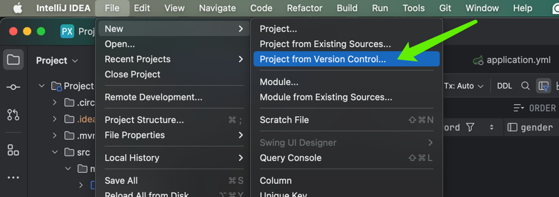
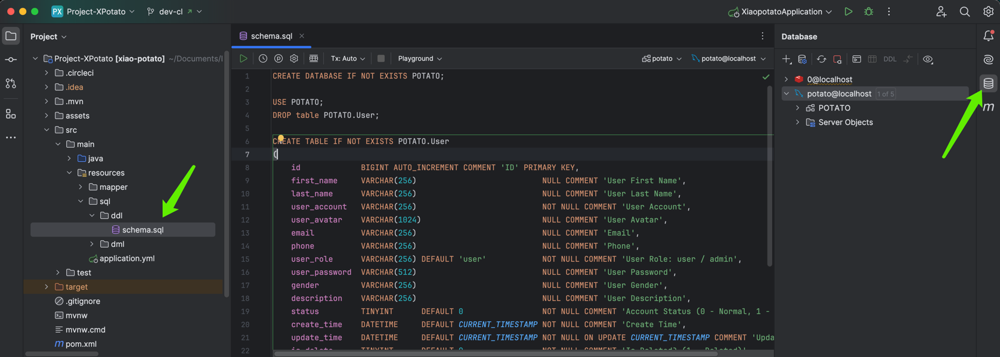
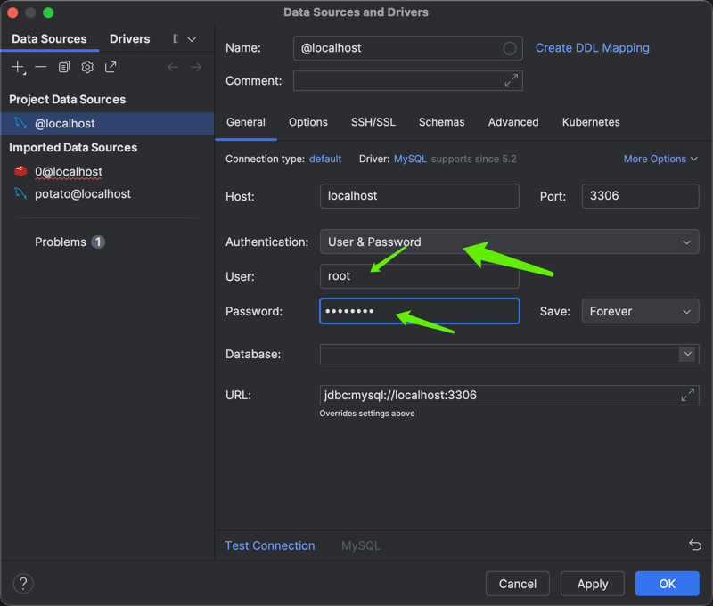
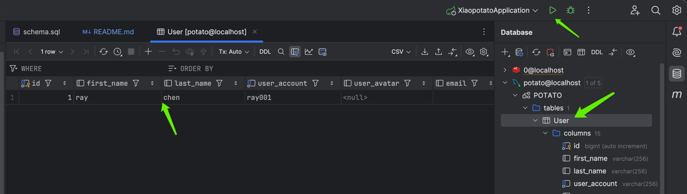
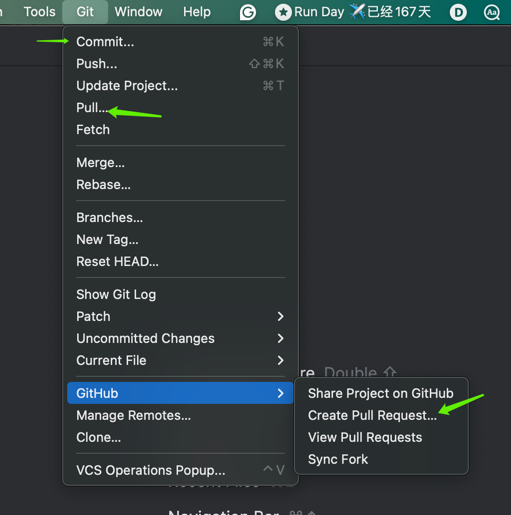

# XiaoPotato Backend - Spring Boot Project +1

This document provides instructions for setting up and running the XiaoPotato backend project, which is built using Spring Boot.

## Prerequisites

To run this project, you'll need:

- Java 17
- Maven
- MySQL 8
- Redis

## Getting Started

### Clone the Repository

Clone the repository from GitHub:

```sh
git clone https://github.com/zi7feng/xiaopotato-be.git
```

# Database Configuration
The project uses MySQL and Redis for data storage. You can configure the database connection settings in `application.yml` located in `src/main/resources`.

Ensure your MySQL server is running and create a database named `potato`. You may adjust the database name and credentials in the `application.yml` file as required:
```yml
spring:
  datasource:
    driver-class-name: com.mysql.cj.jdbc.Driver
    url: jdbc:mysql://localhost:3306/potato?serverTimezone=America/New_York
    username: root
    password: rootroot
```
The project also uses Redis for session storage:
```yml
  redis:
    port: 6379
    host: localhost
    database: 0
```

Run `src/main/resources/sql/ddl/schema.sql` to initialize the database.

# Build and Run the Project
Navigate to the project root directory:

```sh
cd xiaopotato-be
```
Use Maven to build the project:

```sh
mvn clean install
```
Start the Spring Boot application:

```sh
mvn spring-boot:run
```
The application will start on port `8080` by default.

# API Documentation
Swagger UI is enabled for this project. After running the application, you can access the API documentation at:

```bash
http://localhost:8080/swagger-ui.html
```

# Start from scratch
[Install `MySql` database](https://dev.mysql.com/doc/refman/8.0/en/mysql-installer.html)

Download `IntelliJ IDEA` and register [student account](https://www.jetbrains.com/shop/eform/students)

Open `IntelliJ IDEA` and fetch new project from [`github`](https://github.com/zi7feng/xiaopotato-be.git): https://github.com/zi7feng/xiaopotato-be.git





Open directory and execute `schema.sql`: `src/main/resources/sql/ddl/schema.sql`, if you have any issue about sql execution, your can use terminal to execute the sql line by line.
MySql login command: `mysql -u [username] -p`

Run the project: 

Frontend request url: `http://localhost:8080/[api path]` -> `http://localhost:8080/user/register`

## Update code with git
Modify code and git[hub] operation 

`git pull` + `git commit` + `github pull request` by GUI

## insert mock post data with unsplash image

execute the [sql](src/main/resources/sql/ddl/insertPostDataAndBindUser.sql)
Use js to craw unsplash image, please check the frontend project: 'node ./puppeteer/index.cjs'
+2
